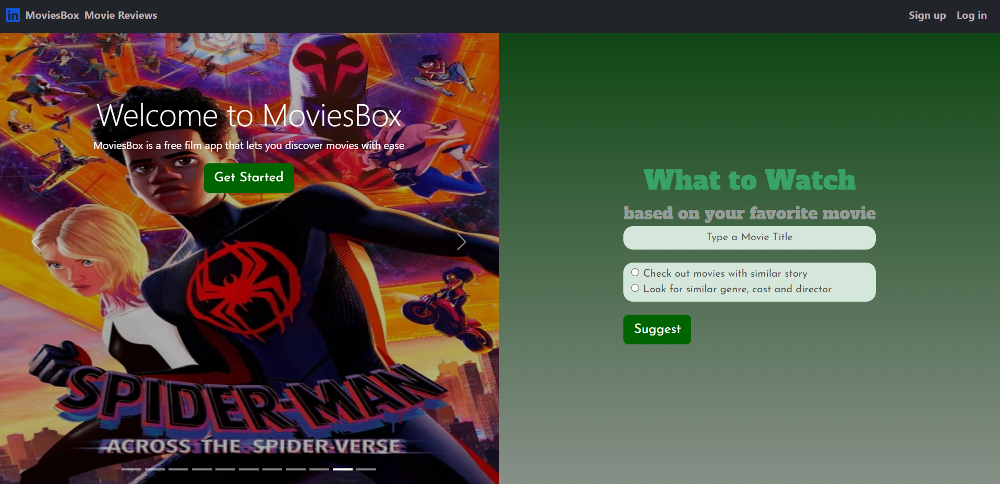
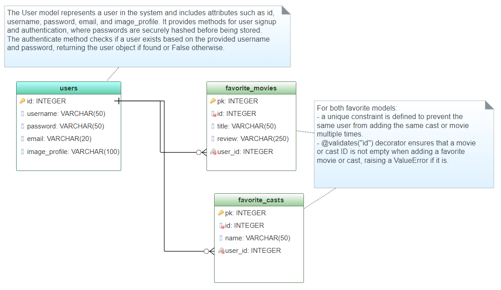

# MoviesBox

## About
MoviesBox is a user-friendly website designed to assist individuals in discovering new movies that align with their personal preferences. The website's search engine incorporates a powerful machine learning algorithm, specifically leveraging content-based filtering techniques. This algorithm has been meticulously trained on a comprehensive dataset consisting of 10,000 diverse movies. By analyzing the characteristics and themes of a user's previously enjoyed films, MoviesBox can accurately suggest relevant and appealing movie recommendations.

## Website Features
### Movie Search - Public Access
MoviesBox offers users two primary options for searching movies. Users can initiate a search based on either the movie's storyline or similarities in genres and cast members. Once the app's search engine identifies movies that match the user's input, it seamlessly sends requests to the API endpoints to retrieve the relevant data. This streamlined process ensures that users receive accurate and tailored movie recommendations based on their preferences.

### Movie Detail - Public access
Upon selecting a movie and being redirected to its dedicated detail page, MoviesBox offers a comprehensive array of valuable information. Users can expect to find an overall overview of the movie, including details such as the director, genres, and relevant cast members. This wealth of information ensures that users can gain a deeper understanding of the movie's key aspects before making a decision to watch it. 

### Cast Detail - Public access
MoviesBox provides users with the ability to navigate through dedicated pages for cast members and directors. By accessing these pages, users can delve into detailed information such as the biography and popular works of the respective cast members and directors. This feature allows users to gain insights into the backgrounds and previous notable contributions of these individuals, enhancing their overall movie-watching experience and facilitating a deeper appreciation for the talent involved in the film industry.

### Movies Reviews - Public access
MoviesBox offers a public section where users can discover random reviews written by MoviesBox users. These reviews provide insights and perspectives on various movies, allowing users to benefit from diverse opinions and experiences. By accessing this feature, users can make informed decisions and enhance their movie selection process with the help of these random reviews

### Public Access Features
The aforementioned features of MoviesBox introduce an interactive aspect, enabling users to navigate the wesbite. This engaging dimension encourages new users to create an account and actively participate, adding their unique experiences to the platform.

### Favorite Movies - Signup Required
Once users have signed up, they gain the ability to curate their own list of favorite movies and conveniently keep track of them. Users can easily add movies to their favorite list and maintain a personalized collection. Additionally, if desired, users can remove movies from their list by selecting the delete option. This feature allows users to create a customized movie library and manage their preferences with ease.

### Movie Reviews - Signup Required
With a signup, users unlock the ability to write reviews for movies, as well as edit or delete their existing reviews. This functionality becomes available once users have added the movie to their favorite movies list. All reviews can be accessed on the Movie detail page for public viewing, ensuring that users can contribute their insights to the wider community. Additionally, users can conveniently manage their reviews through the "My Reviews" tab, providing them with better control and organization of their feedback and opinions.

### Favorite Casts - Signup Required
In a similar manner to movies, users have the ability to add individuals, such as directors and cast members, to their list of favorite casts. This feature allows users to conveniently keep track of the works of these individuals and stay updated on their latest projects. By curating a personalized favorite casts list, users can enhance their movie-watching experience and further explore the contributions of talented directors and cast members.

## Database Schema
Designed using the GenMyModel Database Diagram Online 

## MoviesBox API
[TMDB API](https://developer.themoviedb.org/reference/intro/getting-started)

## Tech Stack Used:
* Python 3.10.6
* SQLAlchemy
* Flask
* PostgreSQL
* HTML
* CSS
* Bootstrap
  
To access the complete list of dependencies, please refer to the requirements.txt file provided in the code files. 
 
Please follow these steps to run the application on your machine:

    python3 -m venv venv
    source venv/bin/activate
    pip install -r requirements.txt
    flask run
Before running, please make sure to include your API key.  